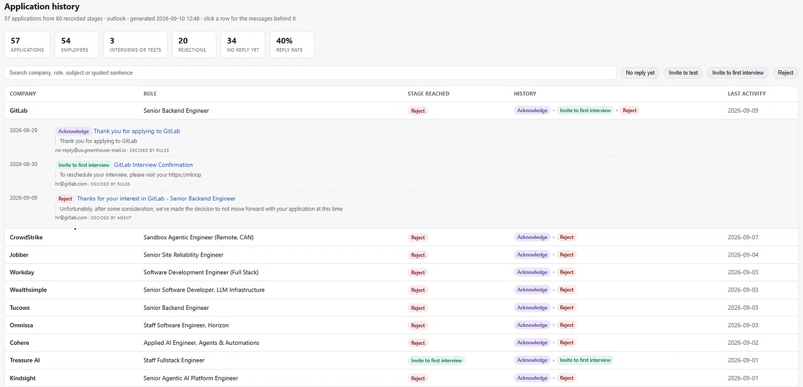

# Inbox Job Tracker

**An AI agent that understands job-related emails and turns them into a structured
application history.**

[](https://github.com/michaelxu-dev/inbox-job-tracker/actions/workflows/ci.yml)
[](LICENSE)
[](https://www.python.org/downloads/)
[](#claude-code-recommended)

It monitors your inbox, identifies job-search activity, and updates your application
timeline automatically — while using deterministic rules for obvious cases and an AI
agent for ambiguous ones.

The result is a CSV file you can open in Excel, Google Sheets, or import into another
tool, and an HTML page grouped into one entry per application:

<p align="center">
  
</p>

Click any row to see the messages behind it. Rules handle the obvious ones, the AI
agent handles the ambiguous ones.

Example output:

```
CompanyName  Position                 Status                     Sender                  Notes                                          Web Link
Northwind    Senior Backend Engineer  Acknowledge                no-reply@greenhouse...  Thanks for applying to Northwind Robotics      https://mail.google.com/...#rfc822msgid...
Northwind    Senior Backend Engineer  Reject                     no-reply@greenhouse...  Unfortunately, at this time we are unable...   https://mail.google.com/...#rfc822msgid...
Contoso      Staff Platform Engineer  Acknowledge                contoso@myworkday.com   Thank you for your interest in a career...     https://mail.google.com/...#rfc822msgid...
Contoso      Staff Platform Engineer  Invite to first interview  dana.reed@contoso.com   We would like to invite you to the next stage  https://mail.google.com/...#rfc822msgid...
Fabrikam     Senior Data Engineer     Acknowledge                careers@fabrikam...     Thanks for applying to Fabrikam                https://mail.google.com/...#rfc822msgid...
Fabrikam     Senior Data Engineer     Invite to test             no-reply@greenhouse...  You have been invited to complete an...        https://mail.google.com/...#rfc822msgid...
```


## Why this exists

Applied to sixty roles and lost track? Your mailbox already holds the answer, spread
over two hundred messages you will never re-read. Point this at it and get one row per
application stage — who, what role, when, and the sentence they actually said it in.

Storing that row is easy. Deciding what a message *means* is not: a rejection and an
invitation are written in nearly the same words. Each line below is a real email that a
keyword search reads backwards.

| The email says | Read literally | What it actually is |
|---|---|---|
| "we are **unable to move forward** with your application" | invitation — it says *move forward* | **rejection** |
| "If your application is a good fit, one of our team members will contact you to **schedule a call**" | first interview | **receipt** — nothing was offered |
| "if you see the job moved to an inactive state, that means … **you were not selected**" | rejection | **receipt** — that is a legend for a dashboard |
| "successful **candidates** move on to a video interview" | invitation | a description of their process |
| "I need a few items from you **before I can move forward**" | invitation | an agency asking for references |
| "**Reminder:** your upcoming interview" | a new interview | the one you already booked |

So the classifier reads context, not keywords: an advancement phrase preceded by a
negation, a hypothetical, a precondition or a third-person subject does not count.
Each row above is pinned by a fixture in `tests/` — every one of them shipped wrong
once.

And that is only the half a rule can be taught. The rest is judgement, and that is
what the agent is for: it reads the bodies the rules could not settle, decides what
each one means, and reports which rules it had to overrule — plus a rotating audit
of what they were *confident* about, because a confidently mislabelled rejection
never asks anyone. ([How it works](#how-it-works) has the full picture; you can also
run it with no AI at all, and the rules alone still produce the application history.)

## Try it in 10 seconds

No mailbox, no credentials, no install:

```bash
git clone https://github.com/michaelxu-dev/inbox-job-tracker && cd inbox-job-tracker
python -m inboxjobtracker.cli demo
```

That prints the sample above from a synthetic mailbox and ends with the path to
`applications.html`, which you can open in a browser. The core has zero dependencies
and runs on any Python 3.9+.

## Quick Start

### Claude Code (recommended)

Get your first structured application history in five minutes, using Gmail. Other
providers are in [Configure your mailbox](#configure-your-mailbox); the same run
[works from a plain terminal](#terminal-mode) too.

#### 1. Clone

Already ran the demo above? You're in the right directory — skip to step 2.

```bash
git clone https://github.com/michaelxu-dev/inbox-job-tracker
cd inbox-job-tracker
```

Stay in this terminal for steps 2 and 3 — Claude Code starts in step 4, and it
inherits the environment of the shell that launches it. Nothing to install and no
separate API key: the skill and subagent ship in the repo's `.claude/` folder, so
`/inbox-job-tracker` appears the moment you open the directory. (Outlook is the
exception — it needs `pip install -e ".[graph]"`, see
[Outlook / Microsoft 365](#outlook--microsoft-365).)

#### 2. Configure

```bash
cp config.example.json config.json
```

Edit two things in `config.json`: your address in `own_addresses`, and
`imap_user` in the `gmail` account. Everything else has a working default.

#### 3. App password

Your normal password will not work. Turn on 2-Step Verification, then create one
at [myaccount.google.com/apppasswords](https://myaccount.google.com/apppasswords)
and put it in the environment — never in the config file:

```bash
export GMAIL_APP_PASSWORD="xxxx xxxx xxxx xxxx"   # PowerShell: $env:GMAIL_APP_PASSWORD="..."
```

A process only sees the variables that existed when it started, which is why this
comes before step 4. On Windows the same rule bites twice: a variable set in the
System Properties dialog does not reach a terminal that is already open. To make it
permanent rather than per-session, use `setx GMAIL_APP_PASSWORD "..."` and then open
a fresh terminal.

#### 4. Run

From that same terminal, start Claude Code:

```bash
claude
```

Then type the command:

```
/inbox-job-tracker                 # default_account, lookback_days  (both from config.json)
/inbox-job-tracker 60              # default_account, last 60 days
/inbox-job-tracker 60 gmail        # gmail account,   last 60 days
/inbox-job-tracker gmail           # gmail account,   lookback_days
```

Two arguments, both optional and in either order: how many days, and which account
from your `config.json`. Plain words work as well — "check my job replies from the
last month" reaches the same run.

The number is **how far back to read mail**, and it only affects the scan: passing
`60` reads two months of mail and costs less, but the spreadsheet still shows
everything earlier runs learned, because `store.json` keeps it all.

`lookback_days` in `config.json` (90 by default) is what applies when you pass no
number — and it does two jobs, which is worth knowing: it is the default scan window
*and* the oldest date published. Rows older than it stay in `store.json` but drop out
of the CSV and the page, so a verdict that has aged out cannot sit there stale
forever. Widening `lookback_days` brings them straight back.

If it stops saying the password variable is missing, Claude Code was started before
step 3. Exit it, check the variable is set (`echo $GMAIL_APP_PASSWORD`, or
`echo $env:GMAIL_APP_PASSWORD` in PowerShell), and start it again.

#### 5. Result

Two files, written together and regenerated from `store.json` every run:

- **`data/gmail/applications.csv`** — one row per employer + role + stage, with the
  sentence each verdict rests on and a link back to the message. Open it in Excel,
  Numbers or Sheets.
- **`data/gmail/applications.html`** — the same rows grouped into one entry per
  application, so a history reads as `Acknowledge › Invite to first interview ›
  Reject` on a single line instead of three you reassemble by eye. Stat cards,
  search, and filter chips; click a row for the messages behind it, each with its
  quoted sentence and a link to the original. One self-contained file, no
  dependencies and no network — double-click to open it.

Nothing is uploaded, nothing is marked as read, and nothing in your mailbox is
changed — the connection is read-only.

#### What Claude Code adds

The skill (`.claude/skills/`) is the entry point: it takes the time range and the
mailbox as plain arguments, runs fetch and classify, hands the reading to the
subagent, and merges the result. What that buys over a bare terminal run:

- **The judgement is done by an agent, not a keyword.** The subagent reads the message
  bodies the rules could not settle and decides what each one actually means — that a
  mail describing a hiring funnel is a receipt, not an interview invitation.
- **Your correspondence stays out of the conversation.** The subagent
  (`.claude/agents/`) reads the mail in its own context and returns only a summary, so
  message bodies never enter the main transcript.
- **It tells you which rules were wrong.** Every run reports the rows where the agent
  overruled the rules — that list is how the classifier gets better instead of quietly
  repeating a mistake for months.
- **It asks you when a mail is genuinely ambiguous** instead of guessing. You know which
  company you applied to; an unattended run does not.
- **No separate API key.** The judgement runs inside your Claude Code session.

## Configure your mailbox

### Gmail / Yahoo / Fastmail

Any IMAP provider, no app registration.

Both Gmail and Yahoo need an **App Password**, not your normal one:

| | Where to get it | Host |
|---|---|---|
| Gmail | 2-Step Verification on, then [myaccount.google.com/apppasswords](https://myaccount.google.com/apppasswords) | `imap.gmail.com` |
| Yahoo | [login.yahoo.com/account/security](https://login.yahoo.com/account/security) → Generate app password | `imap.mail.yahoo.com` |

Set `imap_user` to your full address (e.g. `you@gmail.com`) in the `gmail` account
block.

`password_env` names the environment variable each account reads, so several mailboxes
can be open at once. Access is read-only — the tool can't send, move or delete mail, and
messages are fetched with `BODY.PEEK`, so nothing is marked as read behind you.

`imap_folders` says which folders to scan. A folder the provider doesn't have (Gmail
labels and Yahoo's `Bulk Mail` differ) is reported and skipped, not treated as an error.
On Gmail, `INBOX` alone misses anything archived or filtered to a label — add
`"[Gmail]/All Mail"` to catch those in one pass.

### Outlook / Microsoft 365

Set `"source": "graph"` and follow [docs/outlook-setup.md](docs/outlook-setup.md). It's a
free Azure app registration, about five minutes, and the guide covers the three settings
that fail confusingly if you miss them.

Outlook is the one path that needs packages installed: it talks to Microsoft Graph over
REST, so `pip install -e ".[graph]"` for `msal` and `requests`. The IMAP providers above
need nothing — `imaplib` is in the standard library.

### Multiple mailboxes

Applying from a personal address and a work one is normal, so `config.json` holds as many
mailboxes as you like. Settings at the top level are shared; each block under `accounts`
overrides only what differs:

```json
{
  "own_addresses": ["you@gmail.com", "you@outlook.com"],
  "default_account": "gmail",
  "accounts": {
    "outlook": {"source": "graph", "client_id": "..."},
    "gmail":   {"source": "imap", "imap_user": "you@gmail.com",
                "password_env": "GMAIL_APP_PASSWORD"}
  }
}
```

```bash
inbox-job-tracker accounts                  # what this config defines
inbox-job-tracker run --account gmail       # or JOBTRACKER_ACCOUNT=gmail
inbox-job-tracker run                       # default_account, else the first defined
```

Each account keeps **its own store** in `data/<account name>` — and its own Graph token
cache in `token_cache-<account name>.json` — so one mailbox's history never merges into
another's, and each spreadsheet covers one inbox. A config with no `accounts` block still
describes a single mailbox the flat way, exactly as before.

## Terminal mode

Everything works without Claude Code. The rules tier is identical; only the judgement
on what they cannot call needs an API key.

### Install

```bash
python -m venv .venv && source .venv/bin/activate   # Windows: .venv\Scripts\Activate.ps1
pip install -e .
```

The core has no dependencies. `pip install -e ".[graph]"` adds Outlook support and
`".[dev]"` adds pytest; extras are additive, so `".[graph,dev]"` installs both on top of
the base package. Want the command on your `PATH` without managing a virtualenv?
[pipx](https://pipx.pypa.io) does it in one step: `pipx install .`

### Run

> Commands here are written as `inbox-job-tracker`, which exists once you
> [install it](#install). Running straight from the clone, use
> `python -m inboxjobtracker.cli` instead — every command works the same either way.

```bash
inbox-job-tracker run --account gmail --days 60   # fetch, classify, write the CSV
inbox-job-tracker run --days 7        # just this week; the spreadsheet keeps its full history
inbox-job-tracker fetch               # read mail
inbox-job-tracker classify            # apply the rules
inbox-job-tracker judge               # optional: ask an LLM about the uncertain ones
inbox-job-tracker html                # rebuild applications.html on its own
inbox-job-tracker accounts            # the mailboxes this config defines
```

`--account NAME` picks a mailbox and `--days N` a time range, on either side of the
subcommand — but pass the same `--account` to every command in a run, or `merge`
writes into a different store than `classify` filled.

### LLM judging

The rules are fast, free and literal. They handle most mail correctly, and everything
they're unsure about lands in that account's `review_queue.json` rather than
being guessed at.

Outside Claude Code, an API key gets those read — the same two-tier design, the same
prompt, just billed per message instead of running in your session:

```bash
export ANTHROPIC_API_KEY="sk-ant-..."   # then set "judge": "on" in config.json
inbox-job-tracker judge
```

It reads two kinds of mail: what the rules found **uncertain**, and a rotating sample of
what they were **confident** about. That second part matters — in practice, confidence is
where the expensive mistakes are. A confidently mislabelled rejection never asks anyone.

Cost is a fraction of a cent per email on Haiku, and each mail is judged once and cached,
so a re-run costs nothing.

## What you get

- **One row per employer + role + stage.** An application reaches each stage once, so a
  resent rejection or an assessment announced and then issued collapse into one row.
- **Interview rounds counted properly.** Arranging one interview takes a request for
  availability, a calendar invite, maybe a reschedule. Those are one round, not three.
- **The sentence the decision rests on**, quoted in a Notes column, so you never have to
  trust it blindly — plus a link straight back to the original message.
- **Nothing thrown away.** Job alerts, newsletters and recruiter spam are classified
  `Unclear` and kept out of the spreadsheet, not deleted.

## How it works

[Watch it as an animation](assets/architecture.gif) — the same diagram, built one
step at a time.

```
   mailbox
      │
      ▼
   prefilter ─────────────────────────────────────► not job mail, dropped
      │
      ▼
 ┌──────────────────────────────────────────────────────────────┐
 │ TIER 1 · the rule engine          free · instant · offline   │
 │ settles the mail whose meaning is unambiguous                │
 └───┬───────────────────────────────────────┬──────────────────┘
     │ confident verdict                     │ cannot call it —
     │                                       │ or WAS confident and
     │                                       │ drew the audit sample
     │                                       ▼
     │   ┌──────────────────────────────────────────────────────┐
     │   │ TIER 2 · THE AI AGENT                                │
     │   │ reads the body, decides what it means,               │
     │   │ and reports which rules it had to overrule           │
     │   │ — a Claude Code subagent, or the API                 │
     │   └───────────────────────────────────┬──────────────────┘
     │                                       │
     └───────────────────┬───────────────────┘
                         ▼
                 applications.csv

 every verdict is cached in store.json — durable, so re-runs are incremental
```

The diagram is the design. The rules are free, instant and offline, so they take the mail
whose meaning is unambiguous; everything else — plus that rotating audit sample — goes to
the agent. Each message is judged once and the verdict is cached in `store.json`, so
re-runs cost nothing.

The prefilter is deliberately generous: it's cheap to discard a non-HR email later and
expensive to never see a rejection at all. `store.json` is the durable record, so a
narrower `--days` window scans less mail without discarding anything already learned.

Which is affordable because the fetch itself is two passes, on both sources. The cheap
one reads headers and a slice of the body for everything in the window — 100 messages per
round trip over IMAP, one page of metadata over Graph. Only what survives the prefilter is
downloaded in full: on a real mailbox, 78 messages out of 1047.

## When rules or instructions change

A rule fix reaches old mail on the next run. `classify` re-derives every verdict it
made itself, so `fetch` then `classify` is enough — there is no cache to clear and
nothing to pay. Only mail still inside the `--days` window is re-examined, though,
because that is all `fetch` wrote; widen the window to reach further back.

What does **not** re-derive is a verdict the agent made. Those carry
`decided_by: "agent"` in `store.json` and are never re-judged — the whole point of
the store is that reading a message costs something and is done once. Their company,
role, evidence sentence and link do refresh from the improved rules; the verdict
does not. So a change to the subagent's instructions or the judge prompt reaches
only mail judged after the change.

To re-judge anyway, delete those entries from `store.json` — or the whole file for a
clean slate — and re-run. Over the API tier that bills for every message again, which
is exactly what the cache exists to avoid, so prefer deleting the entries you
actually want reconsidered.

## Privacy

Your mail is read locally and stays on your machine. The rules run entirely offline.
Nothing leaves the machine unless you use the AI tier, and then only the messages queued
for review — never the whole mailbox. In Claude Code the subagent reads them in an
isolated context, so they stay out of the main conversation. `config.json`,
`token_cache*.json` and `data/` are all gitignored. Passwords and API keys are never read
from the config file — only from the environment, which is why each account names its own
variable in `password_env`.

## File structure

```
inbox-job-tracker/
├── config.example.json          # copy to config.json - mailboxes, window, thresholds
├── pyproject.toml               # packaging, the inbox-job-tracker command, optional extras
│
├── inboxjobtracker/             # the package
│   ├── cli.py                   # run | fetch | classify | judge | merge | html | demo | accounts
│   ├── config.py                # config + accounts resolution; each account owns data/<name>
│   ├── prefilter.py             # is this mail job-related at all? deliberately generous
│   ├── rules.py                 # the classifier: reject vs receipt vs invitation, and why
│   ├── report.py                # store -> applications.csv, one row per stage
│   ├── html.py                  # store -> applications.html, one row per application
│   ├── store.py                 # the durable record; makes re-runs incremental
│   ├── judge.py                 # optional LLM second opinion over the API
│   ├── graph_auth.py            # Microsoft OAuth device-code flow (MSAL)
│   └── sources/                 # interchangeable mailboxes: same fetch(cfg, days) contract
│       ├── imap.py              # Gmail, Yahoo, Fastmail - app password, two-pass fetch
│       ├── graph.py             # Outlook.com / Microsoft 365
│       └── demo.py              # synthetic mailbox, no credentials needed
│
├── .claude/                     # ships with the repo; appears when you open it in Claude Code
│   ├── skills/inbox-job-tracker/SKILL.md    # the /inbox-job-tracker command
│   └── agents/inbox-job-tracker.md          # the subagent that reads the queued mail
│
├── tests/
│   ├── fixtures/emails.json     # every email the classifier once got wrong
│   ├── test_rules.py            # ...and what it must say about each one
│   ├── test_html.py             # the page says what the CSV says, and escapes what it shows
│   └── test_config.py           # accounts, per-account stores, IMAP fetch and links
│
├── docs/outlook-setup.md        # the Azure app registration, five minutes
└── data/                        # created on first run, gitignored - your mail lives here
    └── <account>/               # candidates.json, store.json, review_queue.json,
                                 # decisions.json, applications.csv, applications.html
```

Two files are worth knowing by name. `data/<account>/store.json` is the durable
record — everything else in `data/` is regenerated from it, which is why the CSV
should never be hand-edited. And `tests/fixtures/emails.json` is the project's
memory: each entry is a real misclassification, with what it should say and why,
so the same bug cannot come back.

## Contributing

The most useful contribution is **an email the classifier gets wrong**. Anonymise it, add
it to `tests/fixtures/emails.json` with what it should be and why, and open a PR — a
failing fixture is a complete bug report. See [CONTRIBUTING.md](CONTRIBUTING.md).

Wanted: more mail sources (Yahoo, Proton Bridge), non-English rejection wording, and ATS
vendors that hide the employer's name.

## License

MIT.
